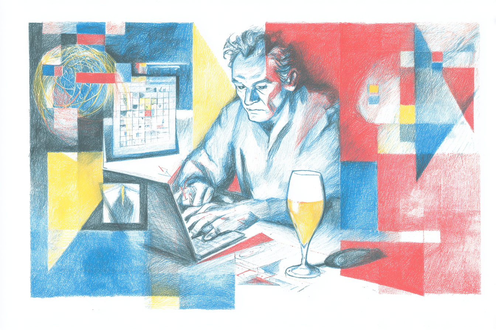

La última vez que escribí fue el 2021, creo.

Entre medio pasaron muchas cosas, desde una pandemia hasta la disrupción de GenAI. Un montón de situaciones que me tienen con un propósito claro para volver a escribir como antes, ojala mejor.

Particularmente, hoy veo que hay mucho contenido hecho para que lo consumas rápido y te sientas bien haciéndolo. Mucho hype, pero poca carne. El foco pareciera ser, simpatizar en temas para más followers, pero sin importar el pensamiento crítico y sin soportar la crítica. Eso no es lo que busco.

Cuando escribo, busco contrastar lo que sé con lo que otros saben y ver qué sale de ahí. A veces no hay conclusión clara, o entendimientos, y eso está bien creo. Otras veces el resultado es concreto, y además, aplicable.

En este sentido, existe una diferencia entre creer algo y saberlo. Creer cambia con un buen argumento, o también, con mucha fé. Mientras que saber es lo que te queda cuando has vivido algo suficientes veces como para ya no poder ignorarlo. 

Este primer post es una especie de declaración en torno a lo anterior: Lo que desaprendí, lo que estoy explorando para saber y lo que construyo para seguir aprendiendo y resolviendo problemas.

Vamos entonces con lo que desaprendí!

---

# Lo que Desaprendí.

Si alguna persona se acercara a mi y me pidiera orientación sobre cómo seguir una carrera de producto, porque le gusta resolver problemas, o cómo persuadir a sus líderes para aplicar prácticas, estándares y herramientas como lo hacen en Spotify, o cómo su organización puede adoptar un mindset de producto, y no de proyecto, le diría:

- Primero, para resolver problemas, no es necesario seguir una carrera de producto. **No confundas identidad con rol**.

- Segundo, **Lo real no es el contexto de otros, sino el de tu organización**. Entender sobre cómo otros operan es un antecedente, no una ley. 

- Y por último, debes estar dispuesto a apostar, y lo más importante, **debes sentirte cómodo con la responsabilidad de perder si no generas valor**.

## 1. No confundas identidad con rol.
El mundo de producto tiene un storytelling magnético. Si quieres resolver problemas que importan, este es el camino. Lo hemos ido construyendo con casos de estudio, conferencias, libros, comunidades, influencers. Entonces, a cierto punto se vuelve convincente, porque hay verdad, y porque el pensamiento de producto es una forma válida y útil de hacer la pega.

El problema es cuando el pitch se convierte en identidad. Cuando "eh hola, soy product manager..." deja de ser una descripción de lo que haces y se convierte en lo que eres. Desde ahí, cualquier amenaza al rol se siente como una amenaza hacia ti, y eso en ocasiones impide ver con claridad.

Lo que la experiencia me obligó a saber es que el valor no viene del título. El valor vive en cómo piensas, en cómo ves los problemas antes de que otros los vean, en cómo conectas lo que existe con lo que podría existir. Eso no requiere un rol específico para operar. 

Confundir el rol con tu identidad es una trampa. Beneficiosa al principio, pero costosa con el tiempo. La consecuencia de esto lo podemos ver con claridad con la IA. Cuando agentes empiezan a hacer lo que hacemos (especificar requerimientos, crear interfaces, codear), la primera reacción no es curiosidad, sino defensa. 

Esa defensa es entendible si tu identidad está amarrada al rol, pero también es lo que te impide ver la oportunidad que la IA no elimina la necesidad de pensar, de ver lo que está a la vuelta de la esquina, de conectar problemas con soluciones que aún no existen. Solo elimina la necesidad de un título para hacerlo.

Entender esto, o desaprenderlo, no fue sólo una reflexión de identidad para mi, fue una decisión sobre cómo dirigir mi vida profesional. Y esa decisión se vuelve más importante cuando la realidad donde trabajas no juega con las mismas reglas que otros grandes.

## 2. Lo real no es el contexto de otros, sino el de tu organización.

Hay una narrativa común y que se escucha bastante entre la gente creando productos. 

>***El problema son los ejecutivos, lo líderes*** que no entienden, no tienen visión, no confían en el proceso. 

Esta declaración, pareciera ser cómoda para nosotros, porque nos deja en el lado bueno de la historia, vemos lo que ellos no ven. Sin embargo, esto es más bien un acto de egocentrismo. Un acto que esconde un problema que es más estructural e incómodo. 

La mayoría de las organizaciones no operan con grandes capitales de riesgo. Operan con sus propias utilidades y pequeñas inversiones locales. Cada decisión compite contra flujo de caja real, contra un P&L, y no contra expectativas futuras. Eso cambia completamente por qué y cómo se toman las decisiones.

Si vemos Spotify (que no es una biblia), es un caso de estudio con un contexto específico. Capital abundante, mercado global, y tolerancia al riesgo alta. Entonces, aplicar sus prácticas sin entender eso no es transformación, sino teatro. Y el disfraz del teatro siempre termina mal.

Lo sé porque lo viví. Estuve en una compañía financiada con capital de riesgo, dejé una carrera corporativa para apostar por eso, y me sacaron a los cinco meses. Sin embargo, no fue por falta de visión, sino porque no levantaron la siguiente ronda. 

Luego de eso, supe que el problema no era la falta de visión de los ejecutivos, aunque eso no los absuelve de todo. El problema era que las reglas con que nos toca jugar en la mayoría de las organizaciones sirven a un modelo y un contexto muy distinto al de Spotify. Y el verdadero valor está en conocer tu propio contexto para construir tu propia forma de operar y no copiar la de otros.

Finalmente, todo esto me llevó a comprender una posición más desafiante. Si el rol no define tu valor, y el contexto determina las reglas del juego, lo que queda es uno mismo y qué tan dispuesto estás a tomar control y hacerte cargo de los resultados de tus apuestas de producto, más que el proceso que lo soporta.

## Debes sentirte cómodo con la responsabilidad de perder si no generas valor

Durante años he venido escuchando el mismo comentario, "el problema es que las organizaciones, o mis líderes, tienen mentalidad de proyecto y no de producto". Si bien la diferencia importa y hay verdad en eso, con el tiempo entendí que ese comentario muchas veces venía para apuntar el dedo hacia otros, sin preguntarse qué estaba pasándonos internamente.

Lo veía en los equipos. Cuando los resultados no llegaban, las explicaciones sonaban similares, por ejemplo, que las priorizaciones no eran las correctas, que el negocio no entendía el proceso, que los stakeholders cambiaban el foco, que faltaba presupuesto, etc. Y aunque eso es real en muchas organizaciones, rara vez aparecía la pregunta inversa: ¿hicimos nosotros lo suficiente para que esos líderes entendieran el valor de operar bajo un enfoque de producto?

Porque la diferencia entre proyecto y producto no es que uno termina y el otro no. Es sobre cómo gestionamos valor de manera progresiva y cómo nuestras apuestas generan retorno. Nuestro rol es saber qué apuesta vale la pena seguir, independiente de si la trajo el negocio o surgió del equipo. Esa capacidad de medir valor y empujar por lo que está a la vuelta de la esquina es lo que desbloquea la conversación de proyecto versus producto, no al revés.

Y si no lo hacemos, terminamos siendo como lo que muchos ya nos ven, como un centro de costo. Pero si somos capaces de articular que por cada peso invertido generamos un retorno medible, cambia completamente cómo nos ven y cómo operamos. Al igual que un analista que gestiona un portafolio de inversiones, su valor final no está en el proceso de análisis, sino en el retorno de sus apuestas. En producto no es tan distinto.

A este punto, no me entiendas mal. No quiero relativizar el proceso, es clave para mantener una operación, porque una metodología bien aplicada da estructura. Sin embargo, también puede convertirse en un escudo. Porque si seguimos el proceso correctamente, y no obtuvimos resultados, entonces ¿quién es el responsable? ¿El equipo, el ejecutivo, el negocio? 

La respuesta incómoda es que la responsabilidad no vive en el proceso. Vive en quien apuesta. Y si no estás dispuesto a hacerte cargo del resultado (no del proceso), sino del valor que genera o no genera, entonces el framework o metodología que uses es irrelevante. Luego, proyecto o producto, da lo mismo.

---

Volví a escribir porque tengo algo que probar — no que decir.

Si estás viendo la misma esquina, bienvenido.

— rodhappi